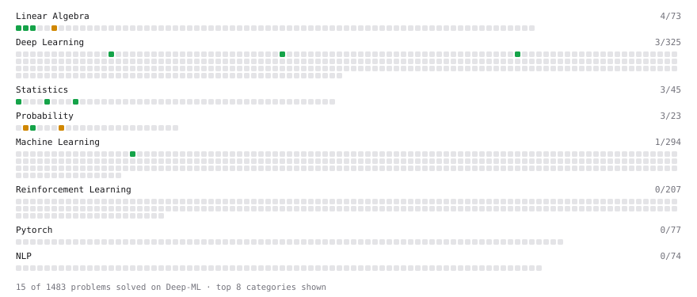

# Deep-ML

My machine learning practice from [Deep-ML](https://www.deep-ml.com). Every solution here was written by hand.

**27** solved · 27 problems · 0 labs · 0 math

[**Browse the interactive portfolio**](https://saeidehvalipour.github.io/deep-ml/) to replay this filling in over time.

## Problems

| | Difficulty | Solved | |
| --- | --- | --- | --- |
| [Calculate 2x2 Matrix Inverse](https://www.deep-ml.com/problems/8) | easy | 2026-02-09 | [solution](problems/0008-calculate-2x2-matrix-inverse) |
| [Calculate Covariance Matrix](https://www.deep-ml.com/problems/10) | easy | 2025-11-11 | [solution](problems/0010-calculate-covariance-matrix) |
| [Calculate P50/P95/P99 Latency Percentiles](https://www.deep-ml.com/problems/293) | easy | 2026-01-21 | [solution](problems/0293-calculate-p50-p95-p99-latency-percentiles) |
| [Calculate Perplexity for Language Models](https://www.deep-ml.com/problems/320) | easy | 2026-01-26 | [solution](problems/0320-calculate-perplexity-for-language-models) |
| [Compute Multi-class Cross-Entropy Loss](https://www.deep-ml.com/problems/134) | easy | 2026-01-19 | [solution](problems/0134-compute-multi-class-cross-entropy-loss) |
| [Derivative of a Polynomial](https://www.deep-ml.com/problems/116) | easy | 2026-01-19 | [solution](problems/0116-derivative-of-a-polynomial) |
| [Dot Product Calculator](https://www.deep-ml.com/problems/83) | easy | 2026-02-10 | [solution](problems/0083-dot-product-calculator) |
| [Empirical Probability Mass Function (PMF)](https://www.deep-ml.com/problems/184) | easy | 2026-01-20 | [solution](problems/0184-empirical-probability-mass-function-pmf) |
| [Gradient Direction and Magnitude](https://www.deep-ml.com/problems/308) | easy | 2026-02-01 | [solution](problems/0308-gradient-direction-and-magnitude) |
| [Implement Binary Cross-Entropy Loss](https://www.deep-ml.com/problems/263) | easy | 2026-01-19 | [solution](problems/0263-implement-binary-cross-entropy-loss) |
| [Implement Compressed Row Sparse Matrix (CSR) Format Conversion](https://www.deep-ml.com/problems/65) | easy | 2026-02-12 | [solution](problems/0065-implement-compressed-row-sparse-matrix-csr-format-conversion) |
| [Implement Ridge Regression Loss Function](https://www.deep-ml.com/problems/43) | easy | 2026-01-06 | [solution](problems/0043-implement-ridge-regression-loss-function) |
| [KL Divergence Between Two Normal Distributions](https://www.deep-ml.com/problems/56) | easy | 2025-11-13 | [solution](problems/0056-kl-divergence-between-two-normal-distributions) |
| [Linear Regression Using Normal Equation](https://www.deep-ml.com/problems/14) | easy | 2026-02-06 | [solution](problems/0014-linear-regression-using-normal-equation) |
| [Matrix-Vector Dot Product](https://www.deep-ml.com/problems/1) | easy | 2025-11-10 | [solution](problems/0001-matrix-vector-dot-product) |
| [Poisson Distribution Probability Calculator](https://www.deep-ml.com/problems/81) | easy | 2026-01-24 | [solution](problems/0081-poisson-distribution-probability-calculator) |
| [Reshape Matrix](https://www.deep-ml.com/problems/3) | easy | 2025-12-02 | [solution](problems/0003-reshape-matrix) |
| [Scalar Multiplication of a Matrix](https://www.deep-ml.com/problems/5) | easy | 2026-02-04 | [solution](problems/0005-scalar-multiplication-of-a-matrix) |
| [Transpose of a Matrix](https://www.deep-ml.com/problems/2) | easy | 2025-11-10 | [solution](problems/0002-transpose-of-a-matrix) |
| [Calculate AUC (Area Under ROC Curve)](https://www.deep-ml.com/problems/277) | medium | 2026-02-11 | [solution](problems/0277-calculate-auc-area-under-roc-curve) |
| [Calculate Eigenvalues of a Matrix](https://www.deep-ml.com/problems/6) | medium | 2025-11-12 | [solution](problems/0006-calculate-eigenvalues-of-a-matrix) |
| [Chi-square Probability Distribution](https://www.deep-ml.com/problems/176) | medium | 2026-01-24 | [solution](problems/0176-chi-square-probability-distribution) |
| [Compute the Hessian Matrix](https://www.deep-ml.com/problems/218) | medium | 2026-02-05 | [solution](problems/0218-compute-the-hessian-matrix) |
| [K-Means Clustering](https://www.deep-ml.com/problems/17) | medium | 2026-02-06 | [solution](problems/0017-k-means-clustering) |
| [Normal Distribution PDF Calculator](https://www.deep-ml.com/problems/80) | medium | 2025-11-13 | [solution](problems/0080-normal-distribution-pdf-calculator) |
| [Product Rule for Derivatives](https://www.deep-ml.com/problems/309) | medium | 2026-02-02 | [solution](problems/0309-product-rule-for-derivatives) |
| [Quotient Rule for Derivatives](https://www.deep-ml.com/problems/312) | medium | 2026-02-03 | [solution](problems/0312-quotient-rule-for-derivatives) |

---

_This file is regenerated by Deep-ML on every push._
